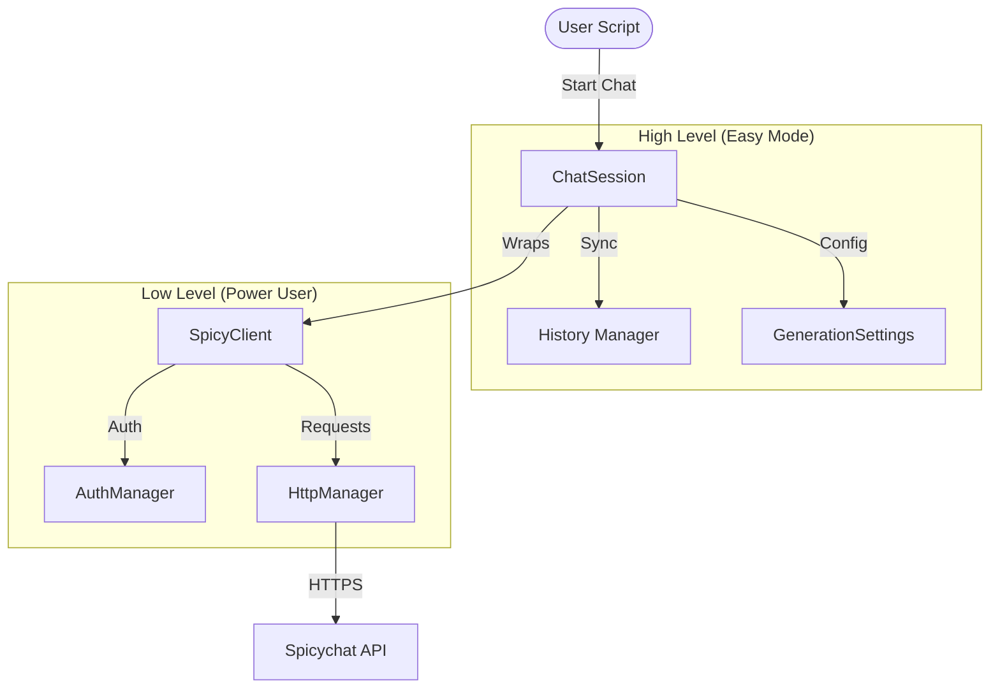

# 🌶️ Spicychat API (Unofficial)


A robust, asynchronous, and fully-typed Python wrapper for the `spicychat.ai` API. Designed for developers who want to build bots, automate interactions, or integrate Spicychat characters into their own applications with zero friction.

## ✨ Key Features

* **🧠 Auto-Persistent Memory:** Chat sessions automatically detect existing conversations and load history. No more managing IDs manually.
* **⚡ Dual-Layer Architecture:**
    * **High-Level:** `ChatSession` for an easy, stateful, "human-like" coding experience.
    * **Low-Level:** `SpicyClient` for raw access to endpoints, search, and bulk operations.
* **⏪ Smart Context Control:** Built-in `undo()`, `edit_last_user_message()`, and `regenerate()` that keep local state and server state perfectly synced.
* **🎭 Persona Management:** Create, switch, and delete user personas programmatically.
* **🎬 Director Mode:** Full support for `Director Mode` commands and custom generation settings (Temperature, Top-K, etc.).
* **🚀 Premium Model Support:** Native support for **DeepSeek R1**, **TheSpice**, and other premium models.

---

## 📦 Installation

You can install the library directly from GitHub using `pip`. No manual cloning required.

```bash
pip install git+https://github.com/SSL-ACTX/spicychat-api.git

```

> Requires `git` to be installed on your system

---

## 🚀 Quick Start

This example logs you in, finds a character, and starts a persistent chat session. If you close the script and run it again, **it will remember where you left off.**

```python
import asyncio
from spicy import SpicyClient, ChatModel

async def main():
    client = SpicyClient()

    # 1. Login (Interactive OTP input on first run, auto-saved afterwards)
    await client.login("your_email@example.com")

    # 2. Start Chat (Auto-searches & Auto-resumes)
    session = await client.start_chat("Asuka Langley")

    # 3. Configure Model (Optional)
    session.model = ChatModel.DEEPSEEK_R1 

    # 4. Chat!
    print(f"Chatting with: {session.character.name}")
    response = await session.send("Hello there!")
    print(f"Response: {response.content}")

    await client.close()

if __name__ == "__main__":
    asyncio.run(main())

```

---

## 🏗️ Architecture

The library is built on a two-tier abstraction model to balance ease of use with raw power.



---

## 🛠️ Advanced Usage

### 1. Controlling Conversation Flow (Undo & Edit)

Mistakes happen. The library handles the complex logic of deleting/editing message pairs (User + Bot) to keep the conversation clean.

```python
# Undo the last interaction (Deletes BOTH the Bot's reply AND your last message)
await session.undo()

# Edit your last message (e.g., fixing a typo)
await session.edit_last_user_message("I actually meant to say this...")

# Edit the Bot's last message (e.g., fixing formatting)
await session.edit_last_bot_message("*She smiles warmly* Of course!")

# Regenerate the last response with different settings
await session.regenerate(temperature=1.2)

```

### 2. Generation Settings

You can control the creativity of the AI globally or per-message.

```python
from spicy import GenerationSettings

# Global Session Settings
session.settings = GenerationSettings(
    temperature=0.7,
    max_new_tokens=200,
    top_p=0.9
)

# Per-Message Override (High creativity for just this prompt)
await session.send(
    "Tell me a crazy sci-fi story", 
    temperature=1.4, 
    max_new_tokens=400
)

```

### 3. Persona Management

Switch between different "masks" instantly.

```python
# List all personas
personas = await client.get_personas()

# Switch active persona for this chat
await session.switch_persona("Iris Seravelle")

# Create a new persona programmatically
await client.create_persona(
    name="Dark Alter Ego",
    description="A villainous version of myself.",
    avatar_path="./avatars/evil_version.png"
)

```

### 4. Low-Level API Access

Need raw data? Bypass the `ChatSession` and use `SpicyClient` directly.

```python
# Search for characters
results = await client.search("Nier Automata")
for hit in results.hits:
    print(hit.document.name, hit.document.id)

# Fetch raw conversation objects
convs = await client.get_conversations(limit=10)

# Rate a bot
await client.rate_bot("2B", action=RatingAction.LIKE)

```

---

## ⚙️ Configuration

* **Tokens:** Authentication tokens are stored securely in `~/.config/spicychat-api/tokens.json`.
* **Logging:** By default, noisy logs (`httpx`) are suppressed. To enable debug logging:
```python
import logging
logging.getLogger("spicy").setLevel(logging.DEBUG)

```


---

## ⚖️ Disclaimer

This library is an unofficial wrapper and is not affiliated with, endorsed by, or connected to Spicychat.ai. Use responsibly and in accordance with the platform's Terms of Service.
